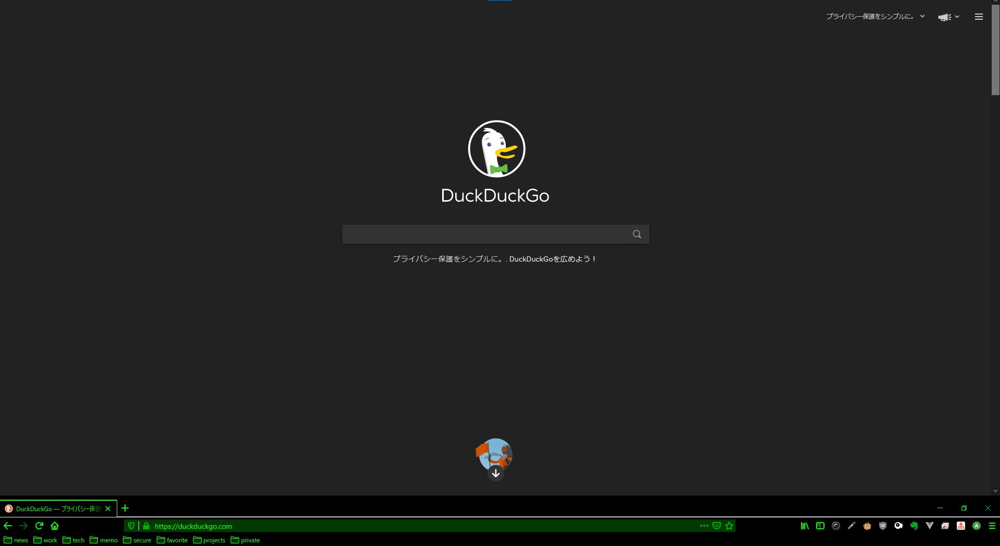

# firefox-custom-styles

firefox browser style change

example


## environment

- Windows10
- firefox 84.0.2

## How to use

### 1. Setting about:config

Input `about:config` in addressbar with browser.

Search `toolkit.legacyUserProfileCustomizations.stylesheets` in searchbar with config screen.

Change display item for true.

### 2. Clone this repository

execute command.

```bash
git clone https://github.com/doberan/firefox-custom-styles.git <firefox profile root directory>/chrome
```

### 3. Reboot filefox

Input `about:profiles` in addressbar with browser.

Click `Restart normally...` button with profile screen.

enjoy browser life :-)